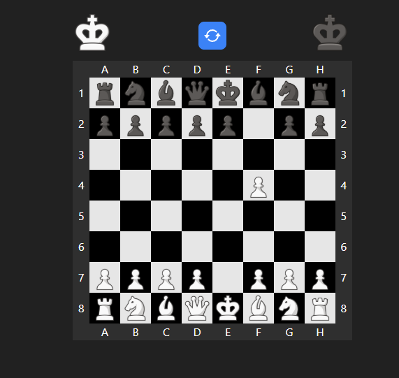

# ♟️ Chess Game - Two Player (React + TypeScript)

A fully functional two-player chess game built with **React**, **TypeScript**, **Tailwind CSS**, and **Framer Motion**.  
Supports all the rules of chess including **check**, **checkmate**, **castling**, **pawn promotion**, and more!

---

## 🎮 Play Now

[](https://chess.liara.run)


## 🧩 Features

- ✅ Valid movement rules (King, Queen, Bishop, Knight, Rook, Pawn)
- 🚫 Illegal move prevention
- ⏳ Turn-based play (White vs Black)
- ♚ Check & Checkmate detection
- 👑 Pawn Promotion
- 🏰 Castling
- 🔄 Animated transitions with Framer Motion
- ⚛️ Built with React Hooks 
- 💻 Clean and scalable code structure

---

  
*Gameplay between two players with full rule validation*

---

## 🛠️ Tech Stack

| Tool | Purpose |
|------|---------|
| **React** | UI framework |
| **TypeScript** | Type safety and better DX |
| **Tailwind CSS** | Utility-first styling |
| **Framer Motion** | Smooth animations |
| **Custom Chess Logic** | All move rules written from scratch |

---

## 🚀 Getting Started

1. Clone the repository:
```bash
git clone https://github.com/ali-tz-2004/chess
cd chess
